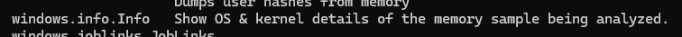
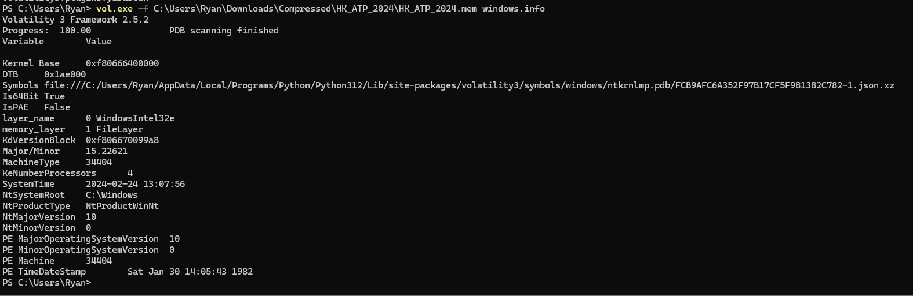
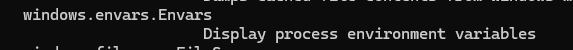
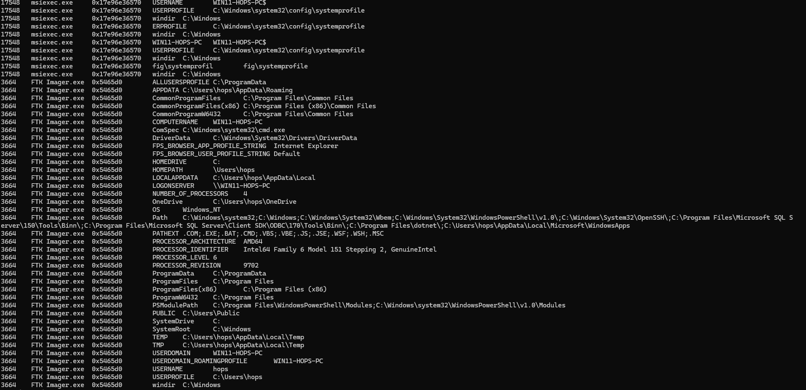

# Memory Forensic: ATP - 1 記憶體取證: ATP - 1

### Firstly, from the challenge, it is understood that the task is to analyze a Windows memory image. After downloading, the file is a mem file, so I decided to use [Volatility 3](https://github.com/volatilityfoundation/volatility3 "Title") for the analysis.

​(Volatility 3)

​​

First, I obtained the basic information of the image. `vol.exe -f (filename) windows.info`​

​​

The SystemTime is observed to be 2024-02-24 13:07:56, which indicates the UTC time when the memory image was created. The MajorOperatingSystemVersion is 10, which suggests that this is a Windows 10 system (tentatively).

​​

Next, you can use the `vol.exe -f (filename) windows.envars`​ plugin to retrieve environment variables, which can provide you with the username and computer hostname.

​​

Within the information, you can see `USERDOMAIN`​ is `WIN11-HOPS-PC`​ (which is the computer hostname), and `USERNAME`​ is `hops`​ (which is the username). Moreover, the clear indication of `WIN11`​ allows us to correct the earlier assumption about the Windows OS Version to Windows 11.

On the left side, you can see "3664 FTK Imager.exe".

​​

The software's description matches the characteristics of the 'Create ram image application name', thus we can conclude the 'Create ram image application name' is FTK Imager.exe and the 'Create ram image application process ID' is 3664.

Thus, the required information has been successfully obtained:

* RAM image created UTC time (YYYY-MM-DD_hh:mm:ss) = 2024-02-24 13:07:56
* Windows OS Version (2 numbers) = 11
* username (xxx) = hops
* Computer hostname (xxxx) = WIN11-HOPS-PC
* Create ram image application name (xxx.exe) = FTK Imager.exe
* Create ram image application process ID (number) = 3664

And according to the requirements of the question, the flag format is: PUCTF24{<RAM image created UTC time(YYYY-MM-DD_hh:mm:ss)>_<Windows OS Version (2 numbers)>_<username>_<computer hostname>_<create ram image application name (XXXX.exe)>_<create ram image application Process ID (number)>}, combine the flag to `PUCTF24{2024-02-24_13:07:56_11_hops_Win11-hops-PC_FTK_Imager.exe_3664}`​

‍
