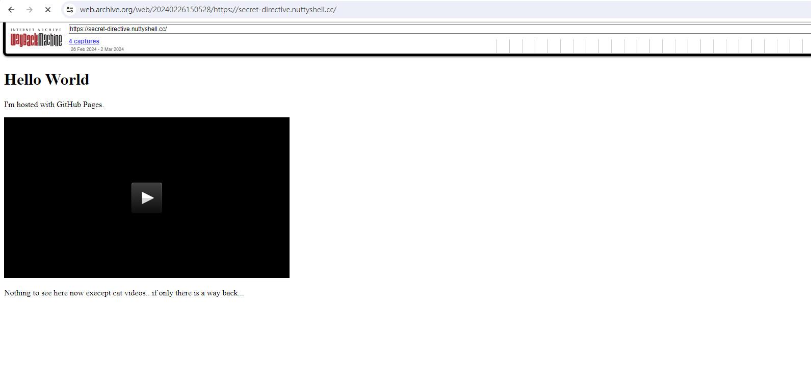

# Detective Conan 名偵探柯南

​First, we opened the provided .eml file and discovered it contained an image, so downloaded the image.

​Subsequently, upon opening the image in hexadecimal, we could see a website \: secret-directive.nuttyshell.cc

​​

After inspecting the video and finding no clues related to the flag, we noticed the mention of `if only there is a way back`​ , which prompted us to use the [Wayback Machine](https://archive.org/web/)

​​

​We navigated to the snapshot from February 26th to look for clues, but none were found, so we proceeded to search for the [Domain DNS record](https://dnschecker.org/all-dns-records-of-domain.php)

​​

​On the CNAME page, we observed the Canonical Name: purplese4shell.github.io

​But found the website is still the same

​We discovered that the website had a 301 redirect to the original site, so we decided to use the [Wayback Machine](https://archive.org/web/) to take a look at purplese4shell.github.io.

​In the earliest record, we could see that there was an additional text.`Shhhhhh! This is a Secret!`​

​After downloading the file and opening it, the flag was obtained​`PUCTF24{B3_m1nDfuL_0f_ur_D1giTaL_F00tprint_i2ofma58b}`​

‍
